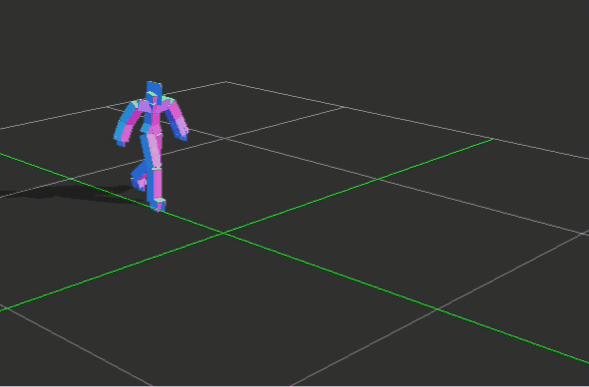
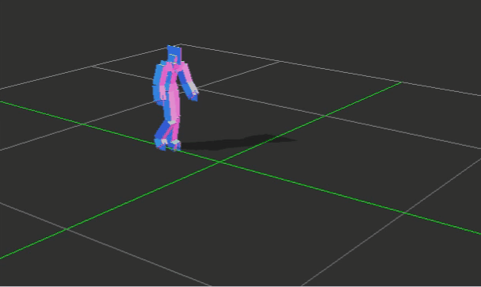
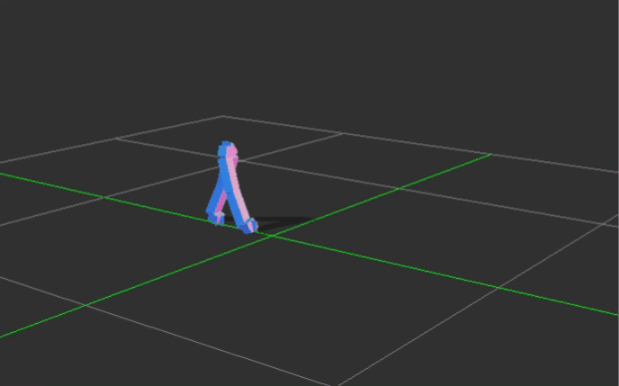
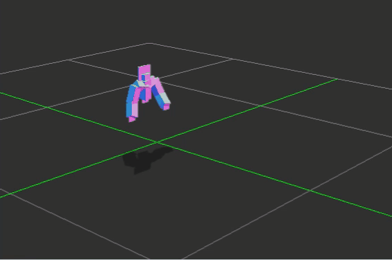

# 모션 신호 예측

- 개요 : 신체 일부 모션 데이터를 통해 전체 모션 움직임을 예측하는 프로젝트

## Run
---
```
python main.py
python main.py --type upper_body
```

### type

1. foot_print (default)
   - 모션의 발자국 data를 추출해 전체 body를 예측
2. upper_body
   - leg data를 통해 upper_body를 예측

## Repository
---
```
└── dataset
        ├── leg
        ├── predict
        ├── raw
        ├── upper_body
└── model
└── output
        ├── acc_loss
        ├── full_body
└── process_body 
```

1. dataset

   1. raw
      - motion style transfer 데이터 셋 proposed by [Aberman et al.](https://arxiv.org/pdf/2005.05751.pdf)
   2. leg, upper_body
      - raw data로 부터 추출한 leg, upper_body data
   3. predict
      - model에서 predict할 때 사용될 테스트 데이터 (1개)

2. model

3. output

   1. full_body
      - upper_body type으로 부터 생성된 upper_body result(Y)와 leg(X)를 합친 결과
   2. 그 외
      - foot_print type으로부터 얻은 전체 모션 결과 혹은 upper_body 결과

4. process_body

   1. dataset/leg , dataset/upper_body에서 사용되는 데이터를 추출하는 코드

## Prediction (angry_01_001.bvh)
---
### **type 1**

|raw data| prediction|
|:---:|:---:|
|</img><br/>|</img><br/>|

### **type 2**

|raw data| prediction|
|:---:|:---:|
|</img><br/>|</img><br/>|


## Reference

- [SIGGRAPH 2020] Skeleton-Aware Networks for Deep Motion Retargeting
- [SIGGRAPH 2020] Unpaired Motion Style Transfer from Video to Animation
